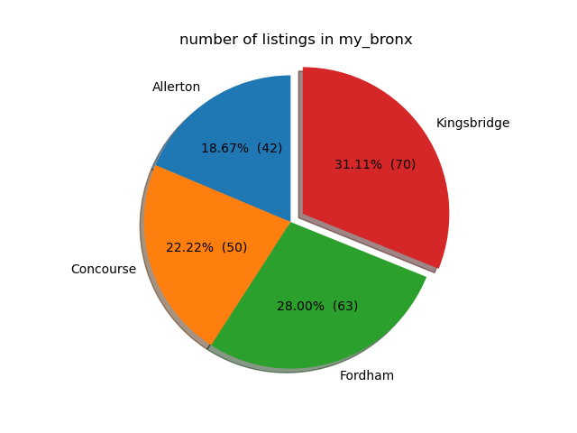
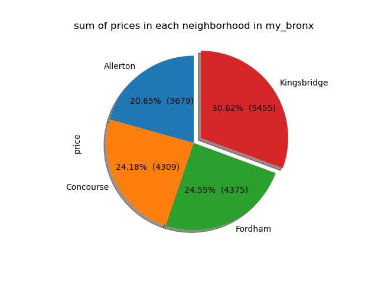
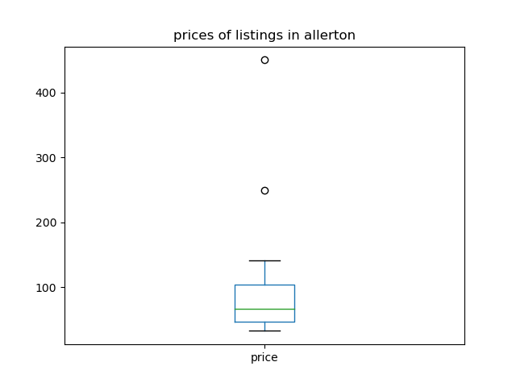
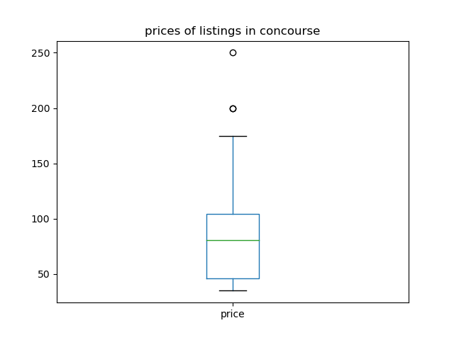
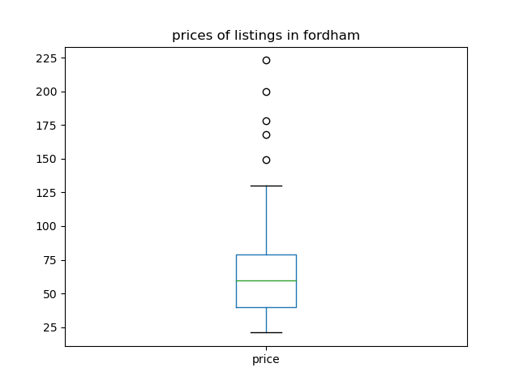
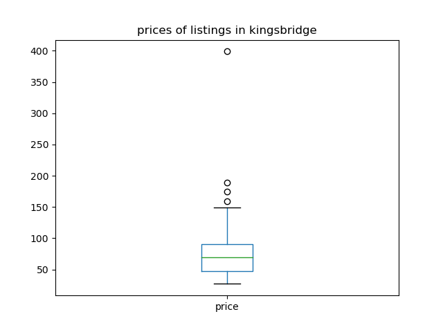
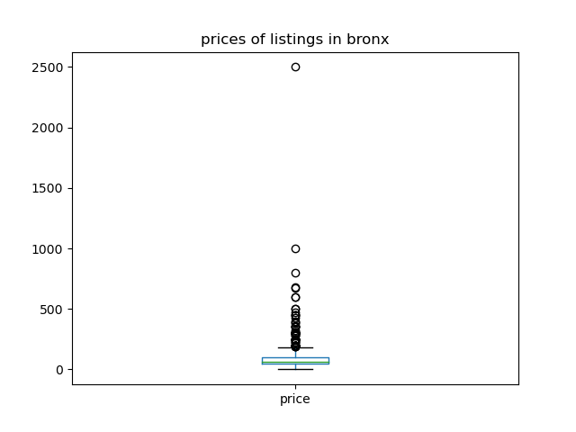
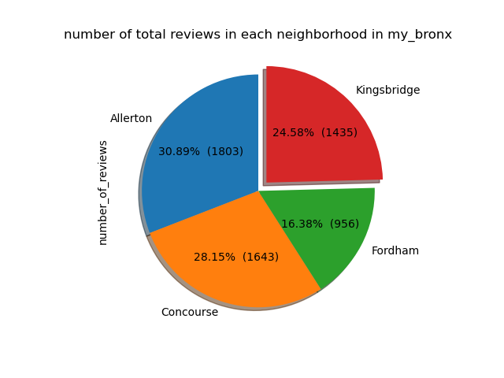

## Demographics 

**ZIP Code: 10463** 

71,360 Population 

1.45 Square Miles 

49,208.93 People per square mile

### Age 

39.8 Median Age 

- Under 18: 21.03% 

- 18 to 34: 22.84% 

- 35 to 64: 36.38% 

- 65 and over: 19.78%

### Sex, Race, and Ethnicity

Male: 47.14% 

Female: 52.86% 

White: 31.65% 

Hispanic: 51.11% 

Black: 11.18% 

Asian: 3.61% 

Other: 2.45%

### Units & Occupancy

29,973 Housing Units 

95.69% Occupied 

- Owner Occupied: 32.14% 

- Renter Occupied: 67.86% 

4.31% Vacant 

- For Rent: 25.64% 

- For Sale: 9.99% 

- Other: 64.37%

### Housing Unit Structure

1954 Median Year Structure Built 

- Single Unit: 5.34% 

- Multi Unit: 94.44% 

- Mobile Home: 0.19% 


## Map of Kingsbridge

**Highlighted Map of Kingsbridge** 


**Airbnb Listings in 2019:** 70

<dl>
<iframe src="kingsbridgeLocations.html" width="600" height="400" frameborder="0" frameborder="0" marginwidth="0" marginheight="0" allowfullscreen></iframe>
</dl>


## Neighborhood Rankings 

The three most important qualities when ranking Airbnb bookings in the Bronx Team: 

**1. Safety** (low crime rate) 

**2. Transportation** (accessibility to & reliability of public transportation, ease of parking) 

**3. Attraction/Activities** (availability of local attractions and recreational activities such as restaurants, parks, etc.) 


### **Kingsbridge Ranking** 

**_Overall Niche Grade: B_** 

**Safety: C** (Relatively low crime rate, but higher than national rate of crime per 100,000 residents for assault and robbery.) 

**Transportation: B+** (Ease of parking, and public transportation is available and accessible but some reviews have mentioned that it can be unreliable at times with long commutes, delays, etc.) 

**Attractions/Activities: A** (Has an urban city feel with good outside spaces, proximity to bars, restaurants, parks, etc. and has nice views.)

## Individual Data Analysis 

Similarly to the group analysis, I began by cleaning the data, and deciding what specifically I wanted to look at in my code. I began playing around with `describe()` and `value_counts()` functions, and other printing functions, before I decided to start by simply looking at how many listings each of the four neighborhoods that my group is working with has. As it turns out, Kingsbridge had the highest number of listings in `my_bronx`, which is what I referred to the four neighborhoods in my code. I was even more pleasantly surprised, however, when I found that Kingsbridge actually had the highest number of listings in all of the Bronx neighborhoods. 

Below are the printed neighborhood listing statistics for `my_bronx` and `bronx`: 
 

```
stats for listings in my_bronx:
count             225
unique              4
top       Kingsbridge
freq               70
Name: neighbourhood, dtype: object

stats for listings in bronx:
count            1091
unique             48
top       Kingsbridge
freq               70
Name: neighbourhood, dtype: object
```

I decided to make a graph to visualize to visually see the percentage of the listings that are in Kingsbridge, compared to the other neighborhoods in `my_bronx`.

 

**Figure 1**

According to **Figure 1**, Allerton has the smallest percentage of listings in `my_bronx`. My first hypothesis for this was that Allerton covered a smaller area, compared to the Kingbridge, since Kingsbridge covers 1.45 square miles, with 49,208.93 people per square mile, which gives it a population of 71,360 (HC2). 

However, I then found out that Allerton actually had a larger area than Kingsbridge (2.34 square miles), and had a greater population (103,732), albeit with (44,413.52 people per square mile). Therefore, it may be probable that there are fewer listings because the houses and apartments are more spread out, but then again, Allerton may not have as many rent-friendly properties as Kingsbridge to begin with. After all, out of the 29,973 housing units available in Kingsbridge, 67.86% of the occupied units are renter-occupied, while 90.01%  of the vacant units are either for rent or for some other purpose (HC2). Of course, we have no data that shows how many of these vacancies are reserved for airbnb, but they are still interesting to consider.

 

**Figure 2** 

Afterwards, I decided to compare the prices of the listings in the neighborhood to see if prices reflected the number of listings and it seems that it did. Kingsbridge had the highest sum of prices while Allerton had the lowest. However, Concourse and Fordham had sums that were very near each other, even though the number of listings they had didn’t seem as close. I made boxplots for each neighborhood as well to see if their prices (min, max, mean, etc.) are similar to each other as well.







**Figure 3.1** 

This data shows that, although each of our neighborhoods have several outliers that throw their total sums and means off balance, they are all very similar in the prices that they have. This seems like a direct reflection of the rankings we did for them in HC3, where, although each neighborhood varied in their rankings for each category by some small detail (some got B for Transportation while others got B+), they were all very similar together, always having the same letter grade even if the + and - differed. Similarly, here, the majority of the prices seem to fall somewhere between 25 and 100, with the median being close to either 50 or 75. The outliers, on the other hand, vary quite a bit. While Concourse and Fordham have outliers that stay at or below 250, Kingsbridge’s outliers go up to 400, while Allerton surpasses even that.

 

**Figure 3.2** 

Now, if we compare that to the prices of listings in all the Bronx neighborhoods, I think they are still quite similar. Although this box plot has a great y-axis range, the majority of the prices still seem to fall somewhere close to 100. The outliers are the ones skewing the data to make it look like all the listings are more expensive, when in fact only a handful of them are (relative to the `my_bronx` neighborhood prices).



**Figure 4** 

Finally, I decided to also compare the total number of reviews in each neighborhood. Since Kingsbridge had the greatest number of listings, I expected it to also have the most reviews, but instead Allerton took that trophy. Of course, we have no way of knowing whether these are good reviews or bad reviews, and whether or not the abundance of reviews came from simply one or two very popular listings in Allerton, so it’s hard to know why this is the case. 

Looking further, we also see that the number of reviews that Kingsbridge had was smaller than Concourse, which had the second smallest number of listings. Again, although there is no real way of knowing for sure, since Concourse scored the lowest for safety in HC3, there is a possibility that some of the reviews might mention safety concerns.


For more details see [GitHub Flavored Markdown](https://guides.github.com/features/mastering-markdown/).

